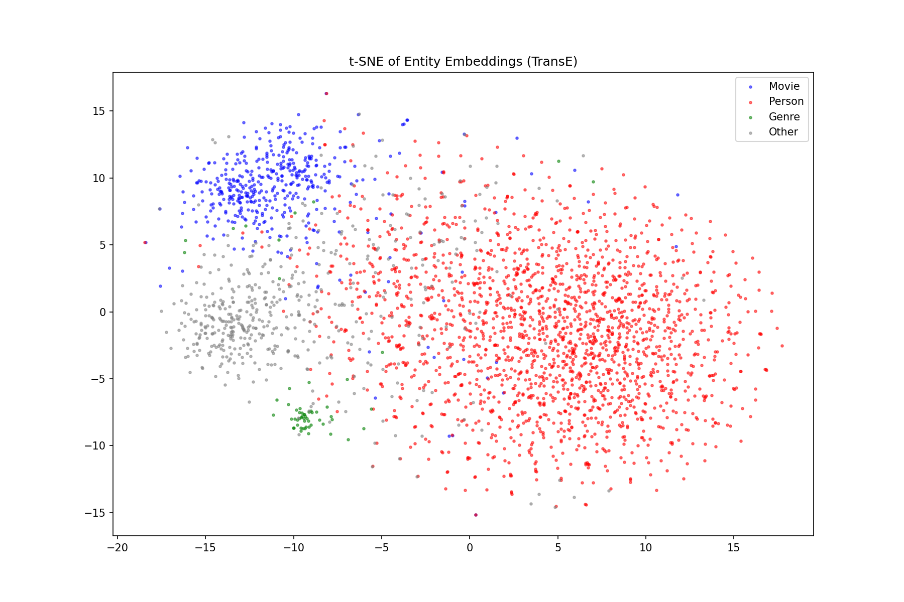

# Webdata
# Movie Knowledge Graph & RAG System

A complete pipeline for building a movie knowledge graph from web data, performing knowledge graph embeddings, and building a RAG-based question answering system.

## Project Structure
```
project-root/
├─ src/
│  ├─ crawl/          # Data collection from TMDB API
│  ├─ ie/             # Named Entity Recognition
│  ├─ kg/             # KB construction, alignment, expansion
│  ├─ reason/         # SWRL reasoning
│  ├─ kge/            # Knowledge Graph Embedding
│  └─ rag/            # RAG pipeline (NL→SPARQL)
├─ data/              # train/valid/test splits + mapping table
├─ kg_artifacts/      # RDF files (ontology, alignment, expanded KB)
├─ reports/           # Final report + tsne visualization
├─ notebooks/         # Jupyter notebooks
├─ README.md
├─ requirements.txt
└─ .gitignore
```

## Installation
```bash
# Clone the repository
git clone https://github.com/Zoeehann/Webdata.git
cd Webdata

# Create virtual environment
python3 -m venv .venv
source .venv/bin/activate

# Install dependencies
pip install -r requirements.txt

# Install spaCy model
python3 -m spacy download en_core_web_sm

# Install Ollama (for RAG)
# Download from https://ollama.com/download
ollama pull gemma:2b
```

## How to Run Each Module

### 1. Data Collection (Crawling)
```bash
python3 src/crawl/step1_build_kb.py
```
Output: `kg_artifacts/movie_kb.ttl`

### 2. Named Entity Recognition
```bash
python3 src/ie/ner.py
```

### 3. Entity Alignment
```bash
python3 src/kg/step2_alignment.py
```
Output: `kg_artifacts/alignment.ttl`, `data/mapping_table.csv`

### 4. Predicate Alignment
```bash
python3 src/kg/step3_predicate_alignment.py
```
Output: `kg_artifacts/predicate_alignment.ttl`

### 5. KB Expansion
```bash
python3 src/kg/step4_expansion.py
```
Output: `kg_artifacts/expanded.ttl`, `kg_artifacts/expanded.nt`

### 6. SWRL Reasoning
```bash
python3 src/reason/swrl_reasoning.py
```

### 7. KGE Training & Evaluation
```bash
python3 src/kge/kge_training.py
```
Output: `data/train.txt`, `data/valid.txt`, `data/test.txt`, `reports/tsne.png`

### 8. RAG Demo
```bash
python3 src/rag/lab_rag_sparql_gen.py
```

## Hardware Requirements

- RAM: 8GB minimum, 16GB recommended
- Storage: 2GB for KB files
- GPU: Not required (CPU training supported)
- Ollama: Required for RAG (Gemma 2B, ~1.7GB)

## KB Statistics

| Metric | Value |
|--------|-------|
| Total triples | 61,809 |
| Movies | 3,347 |
| Persons | 17,265 |
| Genres | 232 |
| Companies | 351 |
| Relations | 16 |

## Screenshot



## Data

- `data/train.txt` — 45714 triples
- `data/valid.txt` — 5047 triples  
- `data/test.txt` — 5361 triples
- `data/mapping_table.csv` — Entity alignment results
